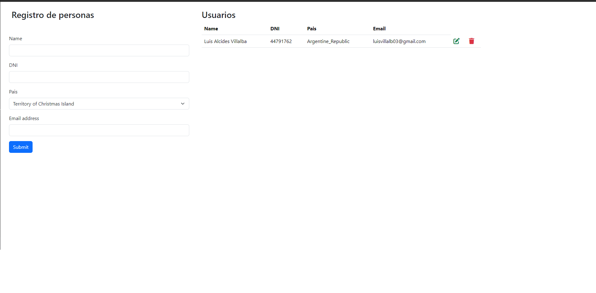
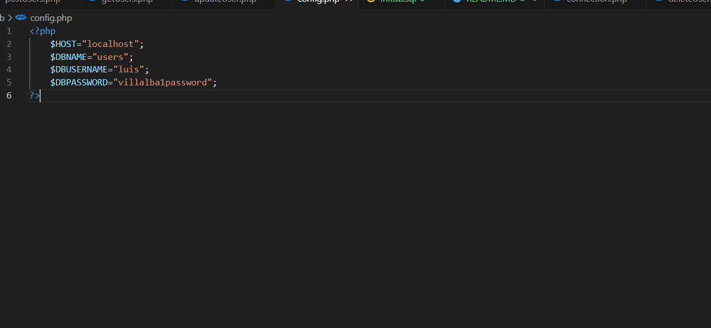

# Crud usuarios utilizando php y msyql

## Comenzar

Para comenzar es necesario tener instalado php y msyql en tu computador.

### Crear database

Lo primero que deberemos de hacer es abrir nuestra base de datos mysql y ejecutar los siguientes comandos que veras acontinuacion

`
CREATE DATABASE IF NOT EXISTS users;

USE users;

CREATE TABLE IF NOT EXISTS users (
    UserID INT PRIMARY KEY AUTOINCREMENT,
    Nombre varchar(100),
    Dni int,
    Pais varchar(100),
    Email varchar(100)
);
`
Los cuales tambien podras encontrar en el archivo initdb.sql de la carpeta db.

### Configurar coneccion

Una ves creada la base de datos y creada las tablas, se debera de modificar las connecciones a tu base de datos

Dentro de la carpeta db en el archivo config.php se debera de modificar los valores de DBUSERNAME y DBPASSWORD por los valores correspondientes a tu coneccion.

Una ves hechas todas esas configuraciones podras utilizar libremente la api.
[EOF]
